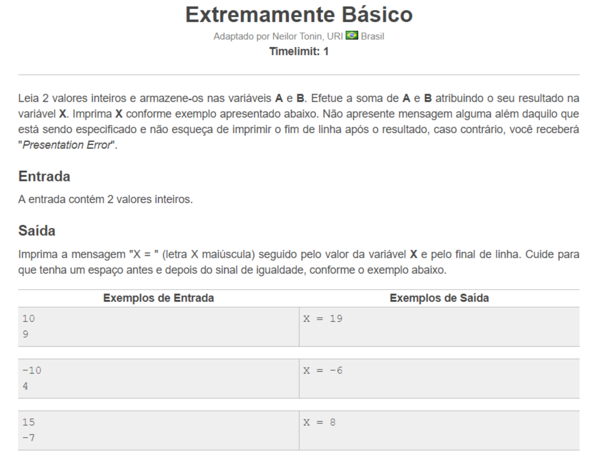

# Exercício 04 - Ambientes de programação e E/S (individual)
  
Data de entrega (item 6): 24/9/2019

+ [Material sobre ambientes de programação](https://www.dropbox.com/sh/dcjxlguwll4scb6/AADmPysnNWYyDXgay09jtNKOa?dl=0). Por enquanto, olhar apenas detalhes sobre "ambiente alternativo" repl.it

   1 Criar uma conta em [repl.it](https://repl.it) - "Sign up"
   
   2 Criar um repl "+ new repl" [para a linguagem C++](https://repl.it/languages/cpp)

   3 Explorar livremente: modificar o programa main.ccp e executar (Run) para ver os resultados no console. Por exemplo, apagar um `;` ou um `}`, modificar a mensagem de texto exibida no console, etc.

+ Ler material "Entrada e saída" (Plano de Aulas) e reproduzir os exemplos usados no `repl.it`.

   4 Explorar livremente o uso do comando cout -  modificar o programa main.ccp e executar (Run) para ver os resultados no console.

   5 Explorar livremente o uso do comando cin -  modificar o programa main.ccp e executar (Run) para ver os resultados no console. 

   6 Escrever um programa em C++ (usando o ambiente repl.it) que implementa o problema apresentado a seguir (Leitura de dois valores inteiros e impressão em tela do resultado da soma). Dica: declare duas variáveis A e B e as utilize em seu programa:  `int A;  int B;`. 
      - Formato de entrega para o item 6: Uma folha de papel com seu nome e (a) código-fonte do programa C++ (escrito a mão), (b) texto explicativo para cada linha do programa C++, e (c) link para o programa C++ criado em sua conta [repl.it](https://repl.it).  
      
   
## Figura 1

