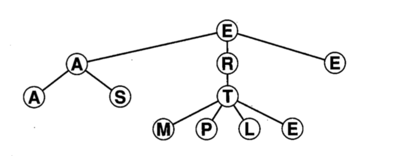
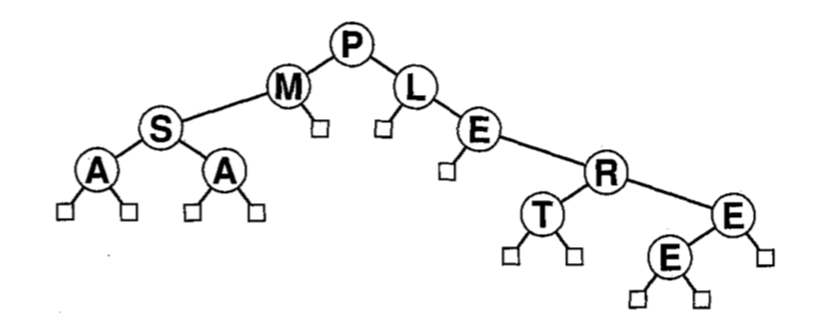

## Árvores

Ou a operação de busca ou a operação de inserção pode ser eficiente na representação com listas, mas não ambas. Estruturas em árvore permitem o acesso e a atualização eficientes em grandes volumes de dados.

 
Uma _árvore_ é uma coleção não-vazia de _vértices_ e _arestas_ que satisfaz alguns requisitos. Um _vértice_ (ou _nó_) é um objeto simples que pode ter um nome e ter outras informações associadas. Uma _aresta_ é uma conexão entre dois nós. Um _caminho_ em uma árvore é uma lista de nós distintos na qual nós sucessivos estão conectados por arestas na árvore. Um nó  da árvore é designado como _raiz_. Uma propriedade fundamental de uma árvore é que há exatamente um caminho entre a raiz e cada um dos outros nós na árvore.

## Árvores Binárias 

Uma _árvore binária_ é definida com um conjunto finito de nós que, ou está vazio, ou consiste de um nó _raiz_ mais os elementos de duas árvores binárias distintas, chamadas de subárvores esquerda e direita do nó raiz. Em uma árvore binária, cada nó tem no máximo duas subárvores.
Há dois tipos de nós: _nós externos_, sem filhos, e _nós internos_, com no máximo  dois filhos.

## Algumas Propriedades

+ _Há exatamente um caminho que conecta quaisquer dois vértices de uma árvore_.

+ Uma árvore com N nós possui N-1 arestas.

## Árvores Binárias de Pesquisa

## Percurso em Árvores Binárias

