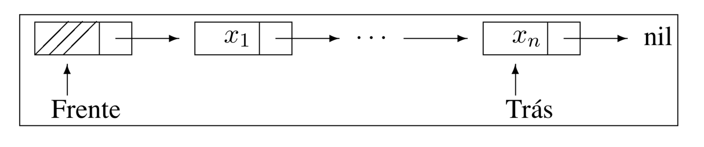

# Estruturas de Dados Fundamentais
  
Fonte do material (além dos livros referenciados):

# Filas (Queues) 

Uma fila é uma lista linear em que todas as inserções 
são realizadas em um extremo da lista, 
e todas as retiradas são feitas em outro extremo da lista.

   + Exemplo: O modelo intuitivo de uma fila é o de uma fila de espera em que as pessoas no início da fila são servidas primeiro e as pessoas que chegam entram no fim da fila.

## Propriedades das Filas

   + FIFO: São chamadas listas fifo (“first-in”, “first-out”).
   + Existe uma ordem linear para filas que é a “ordem de chegada”.

## Aplicações

São utilizadas quando desejamos processar itens de acordo com a ordem “primeiro-que-chega, primeiro-atendido”.

   + Sistemas operacionais utilizam filas para regular a ordem na qual tarefas devem receber processamento e recursos devem ser alocados a processos.

## Filas como TAD

   + put (Queue, element). Insere element no final da fila.
   + get (Queue). Retorna elemento que está no início da fila, retirando-o da fila.
   + isEmpty (Queue). Esta função retorna true se a fila está vazia; senão retorna false.

É necessário manter dois índices, 
um para o início da fila (_head_) e 
outro para o final da fila (_tail_).
Temos head = tail quando a fila estiver vazia.

Na implementação de filas com vetores, com tamanho máximo M,
Se head = tail +1, ou (tail = M e head = 0), a fila estará cheia.

