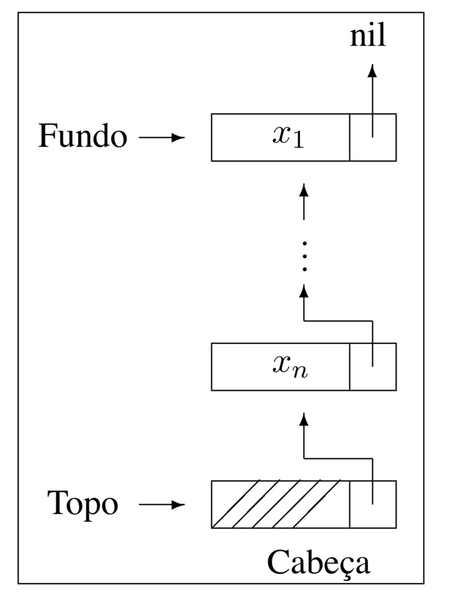

# Estruturas de Dados Fundamentais
  
Fonte do material (além dos livros referenciados):

# Pilhas (Stacks) 

Uma pilha é uma lista linear em que inserções, retiradas e, em geral, acessos, são feitos em apenas um  extremo da lista.

Os itens são colocados um sobre o outro. O item inserido mais recentemente está no topo e o inserido menos recentemente no fundo.

   + Exemplo: O modelo intuitivo é o de um monte de pratos em uma prateleira, sendo conveniente retirar ou adicionar pratos na parte superior.

## Propriedades das Pilhas

   + LIFO: o último item inserido é o primeiro item que pode ser retirado da lista. Pilhas são listas lifo (“last-in, first-out”).

   + Existe uma ordem linear para pilhas, do “mais recente para o menos recente”.

   + É ideal para estruturas aninhadas de profundidade imprevisível.

Uma pilha contém uma seqüência de obrigações adiadas. A ordem de retirada garante que as estruturas mais internas serão processadas antes das mais externas.

## Aplicações 

Aplicações em estruturas aninhadas:

   + Quando é necessário caminhar em um conjunto de dados e guardar uma
lista de coisas a fazer posteriormente.
   + O controle de seqüências de chamadas de subprogramas. 
   + A sintaxe de expressões aritméticas.
   + As pilhas ocorrem em estruturas de natureza recursiva (como árvores) e são utilizadas para implementar a recursividade.

## Pilha como TAD (Tipo Abstrato de Dados) 

   + push (element, Stack)
   + pop (Stack) 
   + isEmpty(Stack) /* returns whether the stack is empty */
   + top (Stack) /* observes the topmost element without removing it from the stack */
   + size (Stack)

## Exemplo

Uso de pilhas para avaliação de expressões aritméticas.

infix: 5 * (((9 + 8) * (4 * 6)) + 7)

postfix: 5 9 8 + 4 6 * * 7 + *
